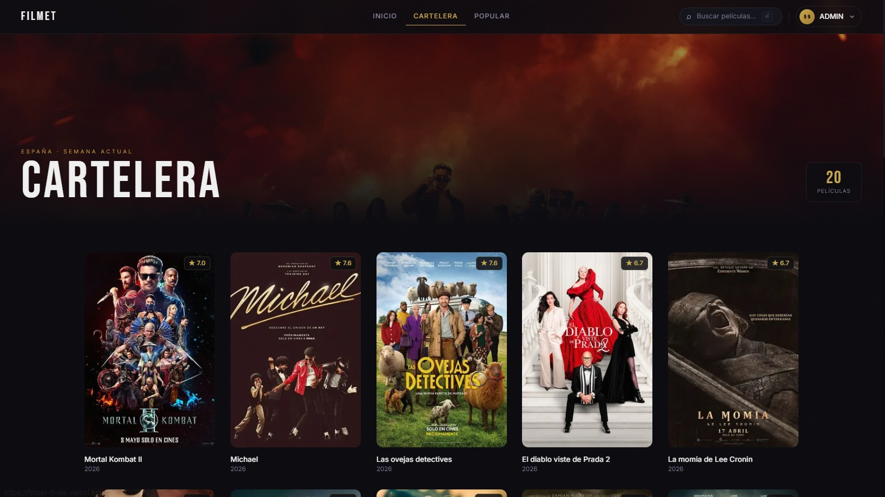
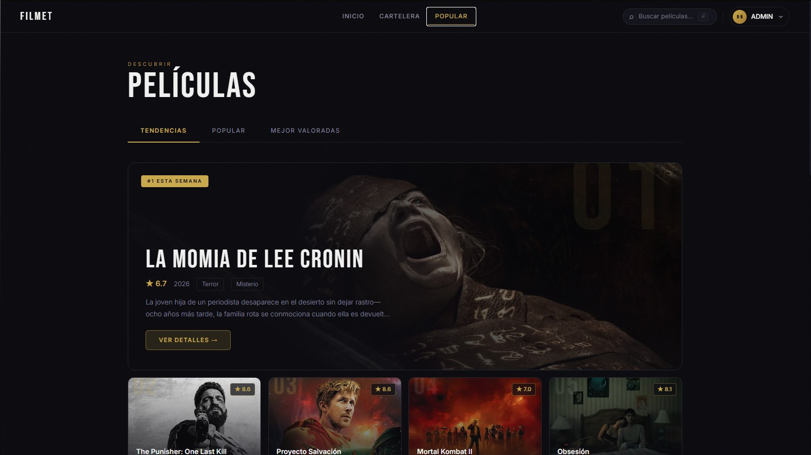
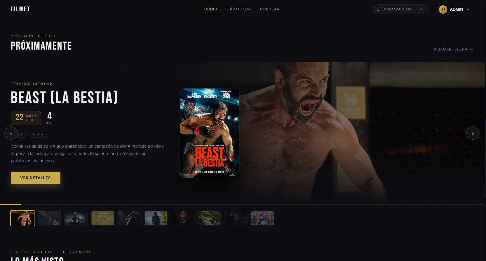
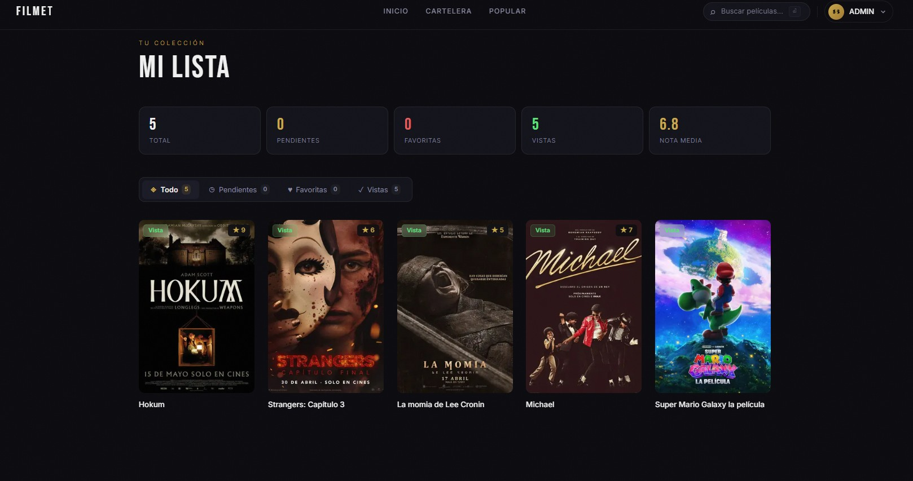

<div align="center">

# 🎬 FILMET

**Tu guía de cine personal — descubre, guarda y comenta las mejores películas**

[](https://filmetweb.vercel.app)
[](https://nextjs.org)
[](https://supabase.com)
[](https://vercel.com)
[](https://filmetweb.vercel.app)

</div>

---

## 📸 Capturas

<div align="center">

### Página Principal


### Cartelera & Próximos Estrenos


### Detalle de Película


### Películas Populares


### Mi Lista Personal


</div>

---

## ✨ Características

| Funcionalidad | Descripción |
|---|---|
| 🎬 **Cartelera en tiempo real** | Películas en cines ahora mismo vía TMDB API |
| 🔜 **Próximos estrenos** | Carousel interactivo con countdown y tráilers |
| 🔥 **Populares** | Rankings actualizados con valoraciones |
| 🔍 **Búsqueda inteligente** | Búsqueda instantánea con resultados en tiempo real |
| ❤️ **Mi Lista** | Guarda películas como favoritas, vistas o pendientes |
| ⭐ **Valoraciones** | Sistema de puntuación del 1 al 10 por usuario |
| 💬 **Comentarios** | Reseñas con filtro de palabras inapropiadas |
| 👤 **Autenticación** | Registro/login con Supabase Auth |
| 🛡️ **Panel Admin** | Moderación de comentarios para administradores |
| 📱 **Responsive** | Diseño adaptado para móvil, tablet y escritorio |

---

## 🛠️ Stack Tecnológico

```
Frontend        → Next.js 15 (App Router) + React 19
Estilos         → Tailwind CSS + CSS personalizado
Base de Datos   → Supabase (PostgreSQL + Auth + RLS)
API de Películas → TMDB (The Movie Database)
Formularios     → Formspree
Despliegue      → Vercel
```

---

## 🚀 Instalación local

### Prerrequisitos
- Node.js 18+
- Cuenta en [Supabase](https://supabase.com)
- API Key de [TMDB](https://www.themoviedb.org/settings/api)

### 1. Clonar el repositorio

```bash
git clone https://github.com/uSearchg/filmet.git
cd filmet
npm install
```

### 2. Configurar variables de entorno

Crea un archivo `.env.local` en la raíz del proyecto:

```env
NEXT_PUBLIC_SUPABASE_URL=tu_supabase_url
NEXT_PUBLIC_SUPABASE_ANON_KEY=tu_supabase_anon_key
TMDB_ACCESS_TOKEN=tu_tmdb_access_token
```

### 3. Configurar Supabase

Ejecuta estas tablas en el SQL Editor de Supabase:

```sql
-- Tabla de perfiles de usuario
create table profiles (
  id uuid references auth.users primary key,
  username text,
  is_admin boolean default false,
  created_at timestamp default now()
);

-- Tabla de películas guardadas
create table user_movies (
  id uuid default gen_random_uuid() primary key,
  user_id uuid references auth.users not null,
  movie_id integer not null,
  status text check (status in ('favorite', 'watched', 'pending')),
  rating integer check (rating between 1 and 10),
  created_at timestamp default now(),
  unique(user_id, movie_id)
);

-- Tabla de comentarios
create table reviews (
  id uuid default gen_random_uuid() primary key,
  user_id uuid references auth.users not null,
  movie_id integer not null,
  username text,
  content text not null,
  created_at timestamp default now()
);
```

### 4. Ejecutar en desarrollo

```bash
npm run dev
```

Abre [http://localhost:3000](http://localhost:3000) en tu navegador.

---

## 📁 Estructura del Proyecto

```
filmet/
├── app/
│   ├── page.js              # Página principal (Hero + Populares + Próximos)
│   ├── cartelera/           # Películas en cines
│   ├── popular/             # Ranking de populares
│   ├── buscar/              # Búsqueda de películas
│   ├── movie/[id]/          # Detalle de película
│   ├── mi-lista/            # Lista personal del usuario
│   ├── login/               # Autenticación
│   └── api/                 # API Routes (TMDB proxy)
├── components/
│   ├── Header.js            # Cabecera con búsqueda y auth
│   ├── Footer.js            # Pie de página con formulario de contacto
│   ├── HomeClient.js        # Secciones de la home
│   ├── MovieActions.js      # Botones de favorito/visto/pendiente
│   └── Reviews.js           # Sistema de comentarios
├── lib/
│   ├── supabase.js          # Cliente de Supabase
│   └── tmdb.js              # Funciones de la API de TMDB
└── public/                  # Assets estáticos
```

---

## 🔒 Seguridad

- **Row Level Security (RLS)** activado en todas las tablas de Supabase
- **Filtro de palabras inapropiadas** con normalización de leet speak y variaciones
- **Inputs validados** tanto en cliente como en servidor
- **Variables de entorno** para todas las claves sensibles (nunca en el código)
- **Políticas de CORS** gestionadas por Next.js API Routes

---

## 🌐 Despliegue

La aplicación está desplegada en **Vercel** con CI/CD automático:

- Cada `git push` a `main` dispara un nuevo despliegue
- Variables de entorno configuradas en el dashboard de Vercel
- URL de producción: **[filmetweb.vercel.app](https://filmetweb.vercel.app)**

---

## 📝 Nota

> Este producto usa la API de TMDB pero no está respaldado ni certificado por TMDB.

<div align="center">
  
</div>

---

<div align="center">

Hecho con ♥ para los amantes del cine

**[filmetweb.vercel.app](https://filmetweb.vercel.app)**

</div>
